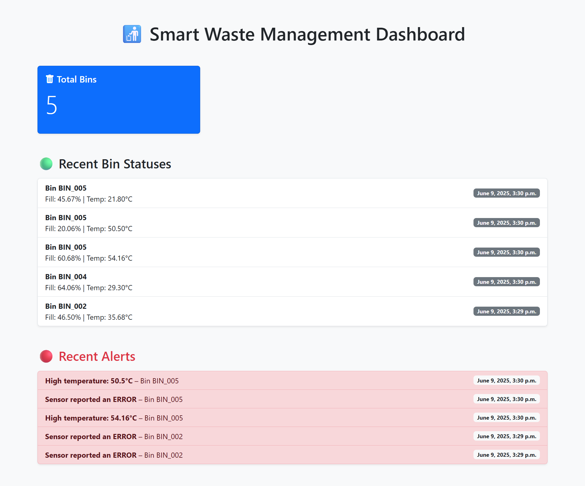

# **Smart Waste Management Platform**

A Django-based web application for monitoring and managing smart waste bins. The platform collects, processes, and displays data related to waste bin status, alerts, and sensor information to optimize waste collection and improve urban sanitation.

### 🖼️ Dashboard Preview


## **Features**
- Real-time monitoring of smart bins' status

- Alerts for bins that require immediate attention

- User authentication and authorization

- Data visualization dashboard with bin metrics

- Integration with Kafka for streaming sensor data (setup ready)

- PostgreSQL as the backend database

- REST API endpoints for accessing bin data

## **Tech Stack**
- Python 3.11

- Django 5.2

- PostgreSQL

- Docker & Docker Compose

- Kafka (for streaming, integration part)

- JavaScript & Bootstrap (for frontend UI)

## **Getting Started**
### Prerequisites
- Docker and Docker Compose installed

- Git installed

- Basic knowledge of Django and Docker
  

### **Installation**

1. Clone the repository:
 ```bash 
 git clone https://github.com/BrightoKusi/smart_waste_platform.git 
 cd smart_waste_platform
 ```

2. Create and activate a Python virtual environment (optional if using Docker):
```bash 
python -m venv venv source venv/bin/activate 
``` 

3. Install dependencies:
```bash 
pip install -r requirements.txt 
```

4. Configure environment variables (e.g., database credentials) in .env or Docker Compose files.

## Running with Docker Compose
```bash 
docker-compose up --build 
```
- This will start your Django app, PostgreSQL database, and any other services defined.
- Access the app at http://localhost:8000/


### Database Setup
If running for the first time, run migrations:

```bash 
docker-compose exec django python manage.py migrate 
```

Create a superuser for admin access:

```bash 
docker-compose exec django python manage.py createsuperuser 
```


## Usage ##
- Navigate to http://localhost:8000/ to access the dashboard.
- Login with your superuser credentials.
- View smart bin statuses, alerts, and manage data.
  

## Project Structure ##
- /smart_waste_platform - main project settings and configurations

- /simulator - Python scripts for generating, consuming data and sending email alerts.

- /smart_waste_ui - Django main project

- /bins - Django app managing bin data, models, views, and templates

- docker-compose.yml - Docker service definitions

- requirements.txt - Python dependencies

## License
This project is licensed under the MIT License.
